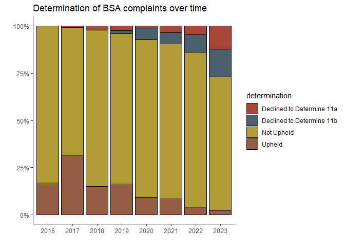
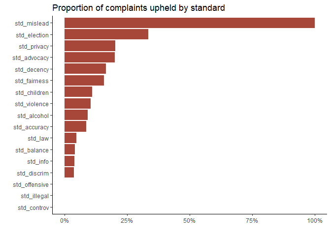
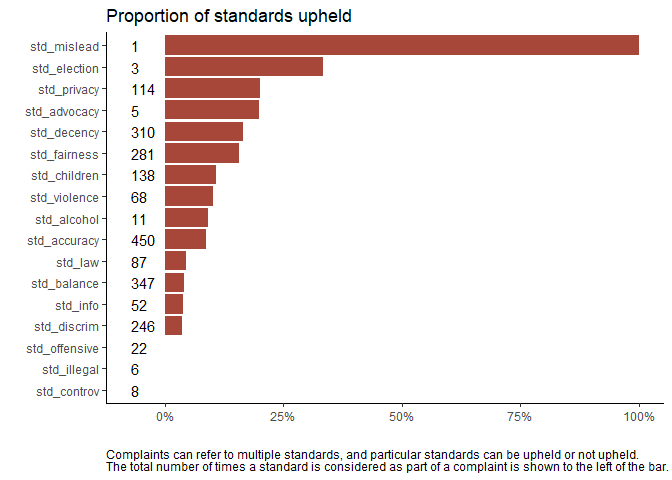
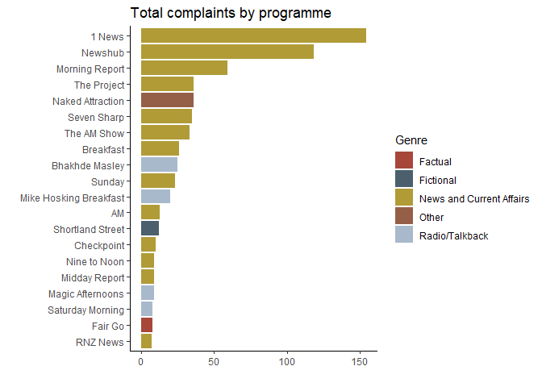
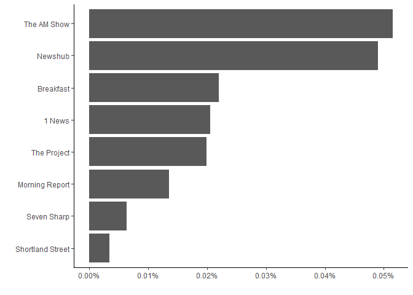

BSA
================
Tom Saunders

``` r
library(readxl)
library(lubridate)
library(readr)
library(dplyr)
library(stringr)
library(tidyr)
library(ggplot2)
library(scales)
library(forcats)
library(Manu)
```

Read in two datasets: the first is for complaints made under the
previous BSA Codebook (1 April 2016 to 30 June 2022); the second is for
complaints made under the current Codebook (1 July 2022 to present).

``` r
bsa_prev <- read_excel("data/20230810 AllClosedFormalComplaints.xlsx")
bsa_curr <- read_excel("data/20230807 AllClosedFormalComplaints.xlsx")
```

Convert `Broadcast Date/Time` to date in each dataset. I can’t find a
way to preserve times.

``` r
bsa_prev$`Broadcast Date/Time` <- as.numeric(bsa_prev$`Broadcast Date/Time`)
bsa_prev$`Broadcast Date/Time` <- as.Date(bsa_prev$`Broadcast Date/Time`, origin = "1899-12-30")

bsa_curr$`Broadcast Date/Time` <- as.Date(bsa_curr$`Broadcast Date/Time`, origin = "1899-12-30")
```

Join the two datasets.

``` r
bsa_full <- full_join(bsa_prev, bsa_curr)
```

Rename columns.

``` r
colnames(bsa_full) <- c("broadcaster", "complaint", "programme", "broadcast_date", "genre",
                        "code", "determination", "decision_date", "majority", "split", 
                        "elect_standards", "elect_notupheld", "elect_upheld", 
                        "fta_standards", "fta_notupheld", "fta_upheld", "paytv_standards",
                        "paytv_notupheld", "paytv_upheld", "radio_standards", "radio_notupheld",
                        "radio_upheld", "standards", "not_upheld", "upheld", "tv_radio")
```

Consolidate individual standards based on previous codebook into
‘standards’ column introduced for new codebook. Repeat for ‘upheld’ and
‘not upheld’ standards. Drop these columns once they are consolidated.

``` r
bsa_full$standards <- coalesce(bsa_full$elect_standards, bsa_full$fta_standards, bsa_full$paytv_standards, bsa_full$radio_standards, bsa_full$standards)
  
bsa_full$not_upheld <- coalesce(bsa_full$elect_notupheld, bsa_full$fta_notupheld, bsa_full$paytv_notupheld, bsa_full$radio_notupheld, bsa_full$not_upheld)

bsa_full$upheld <- coalesce(bsa_full$elect_upheld, bsa_full$fta_upheld, bsa_full$paytv_upheld, bsa_full$radio_upheld, bsa_full$upheld)

bsa_full <- select(bsa_full, -c(11:22))
```

Fix factors.

``` r
# Recode 'broadcaster' "Newstalk ZB" as the actual Broadcaster

bsa_full$broadcaster <- recode(bsa_full$broadcaster, "Newstalk ZB" = "NZME Radio Ltd")

# Recode 'complaint' numbers as what they have been renumbered to

bsa_full$complaint <- recode(bsa_full$complaint, 
                             "2016-053 (renumbered 048B)" = "2016-048B",
                             "2017-027 (renumbered 018B)" = "2017-018B",
                             "2017-028 (renumbered 018C)" = "2017-018C",
                             "2017-029 (renumbered 018D)" = "2017-018D")

# Recode programme to remove duplicates with minor spelling variations and date variations

bsa_full <- bsa_full |>
  mutate(
    programme = case_when((substr(programme, 1, 6)) %in% c("1 News", "1 NEWS") ~ "1 News",
                          (substr(programme, 1, 8)) %in% c("One News", "ONE News") ~ "1 News",
                          (substr(programme, 1, 3)) == "Ban" ~ "Ban 1080 Election Programme",
                          (substr(programme, 1, 4)) == "Bhak" ~ "Bhakhde Masley",
                          (substr(programme, 1, 8)) == "Box Seat" ~ "Box Seat",
                          (substr(programme, 1, 9)) %in% c("Breakfast", "TV1 Break") ~ "Breakfast",
                          (substr(programme, 1, 19)) == "Canterbury Mornings" ~ "Canterbury Mornings",
                          (substr(programme, 1, 5)) == "Dasam" ~ "Dasam Granth da Sach",
                          (substr(programme, 1, 13)) == "Early Edition" ~ "Early Edition",
                          (substr(programme, 1, 21)) == "Entertainment Tonight" ~ "Entertainment Tonight",
                          (substr(programme, 1, 7)) == "Fair Go" ~ "Fair Go",
                          (substr(programme, 1, 17)) == "Hauraki Breakfast" ~ "Hauraki Breakfast",
                          (substr(programme, 1, 13)) == "Have You Been" ~ "Have You Been Paying Attention",
                          (substr(programme, 1, 14)) == "Inside the Red" ~ "Inside the Red Arrows",
                          (substr(programme, 1, 5)) == "Magic" ~ "Magic Afternoons",
                          (substr(programme, 1, 14)) == "Morning Report" ~ "Morning Report",
                          (substr(programme, 1, 16)) == "Naked Attraction" ~ "Naked Attraction",
                          (substr(programme, 1, 6)) %in% c("Newshu", "Newhub") ~ "Newshub",
                          (substr(programme, 1, 12)) == "Nine To Noon" ~ "Nine To Noon",
                          (substr(programme, 1, 14)) == "Overnight Talk" ~ "Overnight Talk",
                          (substr(programme, 1, 14)) %in% c("Q+A", "Q +") ~ "Q+A",
                          (substr(programme, 1, 8)) == "RNZ News" ~ "RNZ News",
                          (substr(programme, 1, 11)) == "Seven Sharp" ~ "Seven Sharp",
                          (substr(programme, 1, 16)) == "Shortland Street" ~ "Shortland Street",
                          (substr(programme, 1, 11)) == "The AM Show" ~ "The AM Show",
                          (substr(programme, 1, 12)) == "The Windsors" ~ "The Windsors",
                          .default = programme),
    genre = case_when((programme == "Morning Report" ~ "News and Current Affairs"),
                      .default = genre)
  )
```

``` r
# Recode 'code' as 'either 'Television' or 'Radio', move to 'tv_radio' column to align with new codebook, then delete 'code' column.

bsa_full$code <- recode(bsa_full$code, 
                             "Free to Air TV" = "Television",
                             "Pay TV" = "Television",
                             "Election Program" = "Television")

bsa_full$tv_radio <- coalesce(bsa_full$code, bsa_full$tv_radio)

bsa_full <- select(bsa_full, -code)

# Remove asterisk and whitespace from columns containing them.

bsa_full <- bsa_full |> 
  mutate(
    standards = gsub("\\*", "", standards),
    not_upheld = gsub("\\*", "", not_upheld),
    upheld = gsub("\\*", "", upheld),
  )

bsa_full$standards <- str_trim(bsa_full$standards, "left")
bsa_full$upheld <- str_trim(bsa_full$upheld, "left")
bsa_full$not_upheld <- str_trim(bsa_full$not_upheld, "left")

# Fix missing values in standards/upheld/not_upheld columns
## Find rows where standards are missing from both 'upheld' and 'not_upheld" columns.

missing <- bsa_full |> 
  filter(is.na(upheld) & is.na(not_upheld))

## Add missing values based on manual BSA decision database lookup

missing[1,10] <- "Discrimination and Denigration"
missing[4, 10] <- "Accuracy" # Complaint 2018-020 
missing[5,10] <- "Balance,Accuracy" # Complaint 2019-006
missing[5,4] <- as.Date("2018-12-17")

## Use case_when to fill in missing values in not_upheld and upheld columns.

missing <- missing |>
  mutate(
    not_upheld = case_when(determination %in% c("Not Upheld", "Declined to Determine 11a", "Declined to Determine 11b") ~ standards,
                           complaint == "2017-101C" ~ "Children's Interests",
                           complaint == "2017-101D" ~ "Children's Interests",
                           complaint == "2019-019B" ~ "Privacy"),
    upheld = case_when(complaint == "2019-019B" ~ "Fairness",
                       complaint == "2017-101C" ~ "Good Taste and Decency",
                       complaint == "2017-101D" ~ "Good Taste and Decency")
  )

## Merge missing dataframe back into bsa_full

bsa_full <- bsa_full |>
  filter(!is.na(upheld) | !is.na(not_upheld)) |> 
  bind_rows(missing)

## Find empty 'standards' values

missing2 <- bsa_full |> 
  filter(is.na(standards))

## Use case_when to fill in missing values in 'standards' columns.

missing2 <- missing2 |> 
  mutate(
    standards = case_when(determination == "Not Upheld" ~ not_upheld,
                          determination == "Upheld" ~ upheld)
  )

## Merge missing standards dataframe back into bsa_full
 
bsa_full <- bsa_full |>
  filter(!is.na(standards)) |> 
  bind_rows(missing2)
```

Create new variable ‘complaint_year’ based on first 4 characters of
‘complaint’.

``` r
bsa_full$complaint_year <- substr(bsa_full$complaint, 1, 4)
```

Reorder columns.

``` r
bsa_full <- bsa_full[, c(1,3,5,4,2,14,13,6,7:12)]
```

Swap standards to column names and not_upheld/upheld to values for each
complaint.

``` r
bsa_full <- bsa_full |>
  pivot_longer(cols = c(upheld, not_upheld), values_drop_na = TRUE) |> 
  separate_longer_delim(value, ",") |> 
  pivot_wider(names_from = value, values_from = name)
```

Rename standard columns.

``` r
bsa_full <- bsa_full |> 
  rename(
    std_privacy = 13,
    std_decency = 14,
    std_discrim = 15,
    std_controv = 16,
    std_accuracy = 17,
    std_fairness = 18,
    std_children = 19,
    std_violence = 20,
    std_law = 21,
    std_balance = 22,
    std_alcohol = 23,
    std_info = 24,
    std_mislead = 25,
    std_advocacy = 26,
    std_election = 27,
    std_offensive = 28,
    std_illegal = 29
  )
```

Remove NULL values.

``` r
bsa_full <- bsa_full |>
  mutate(across(13:29, as.character))

# Fix instance of both values being added 
bsa_full[65,17] <- "not_upheld"
```

Plots

``` r
ggplot(bsa_full, aes(x = complaint_year, fill = determination)) +
  geom_bar(position = "fill", colour = "black") +
  theme_classic() +
  scale_fill_manual(values = get_pal("Kaka")) +
  labs(title = "Determination of BSA complaints over time") +
  xlab("") +
  ylab("") +
  scale_y_continuous(labels = scales::percent)
```



``` r
summary2 <- bsa_full |>
  select(13:29) |>
  pivot_longer(cols = everything()) |> 
  count(name,value) %>%
  filter(value != "NULL") |> 
  pivot_wider(names_from = value,values_from = n) |> 
  group_by(name) |>
  mutate(
    total = sum(upheld, na.rm = TRUE) + sum(not_upheld, na.rm = TRUE),
    upheld_pc = sum(upheld, na.rm = TRUE) / total,
  ) 

ggplot(summary2, aes(x = fct_reorder(name, upheld_pc), y = upheld_pc, fill = factor(upheld_pc))) +
  geom_col() +
  coord_flip() +
  theme_classic() +
  scale_fill_manual(values = rep("#A7473A", 15)) +
  scale_y_continuous(labels = scales::percent) +
  xlab("") +
  ylab("") +
  labs(title = "Proportion of standards upheld",
       caption = "Complaints can refer to multiple standards, and particular standards can be upheld or not upheld.") +
  guides(fill=FALSE) +
  geom_text(aes(label = total), position = position_dodge(0))
```

    Warning: The `<scale>` argument of `guides()` cannot be `FALSE`. Use "none" instead as
    of ggplot2 3.3.4.



``` r
ggplot(summary2, aes(x = fct_reorder(name, upheld_pc), y = upheld_pc, fill = factor(upheld_pc))) +
  geom_col() +
  geom_text(data = summary2, 
            mapping = aes(y = -0.07, 
                          x = name, 
                          label = total), 
            hjust = 0, nudge_x = 0) +
  coord_flip() +
  theme_classic() +
  scale_fill_manual(values = rep("#A7473A", 15)) +
  scale_y_continuous(labels = scales::percent) +
  xlab("") +
  ylab("") +
  theme(plot.caption = element_text(hjust = 0)) +
  labs(title = "Proportion of standards upheld",
       caption = "Complaints can refer to multiple standards, and particular standards can be upheld or not upheld.\nNumbers are total counts of standards.") +
  guides(fill=FALSE)
```



``` r
top_prog <- bsa_full |> 
  group_by(programme, genre) |> 
  tally() |> 
  ungroup() |> 
  arrange(desc(n)) |> 
  slice_head(n = 20)

# Normalise to average viewership - values are a rough guide from Google

top_prog <- top_prog |> 
  mutate(
    viewership = case_when(programme == "1 News" ~ "751000",
                           programme == "Newshub" ~ "241000",
                           programme == "Morning Report" ~ "434000",
                           programme == "The AM Show" ~ "64000",
                           programme == "The Project" ~ "181000",
                           programme == "Breakfast" ~ "118000",
                           programme == "Seven Sharp" ~ "546000",
                           programme == "Shortland Street" ~ "344000")
  )

ggplot(top_prog, aes(x = fct_reorder(programme, n), y = n, fill = genre)) +
  geom_col() +
  coord_flip() +
  scale_fill_manual(values = get_pal("Kaka")) +
  theme_classic() +
  xlab("") +
  ylab("")
```



``` r
top_prog$viewership <- as.numeric(top_prog$viewership)

viewers <- top_prog |> 
  filter(!is.na(viewership)) |> 
  mutate(
    pc = n / viewership) |> 
  arrange(desc(pc))

ggplot(viewers, aes(x = fct_reorder(programme, pc), y = pc)) +
  geom_col() +
  coord_flip() +
  theme_classic() +
  xlab("") +
  ylab("") +
  scale_y_continuous(labels = percent)
```


